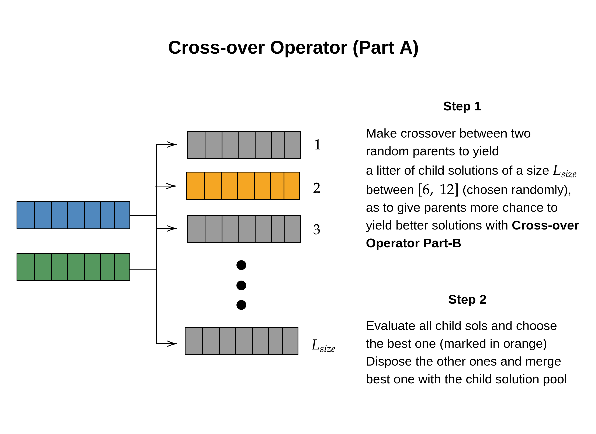
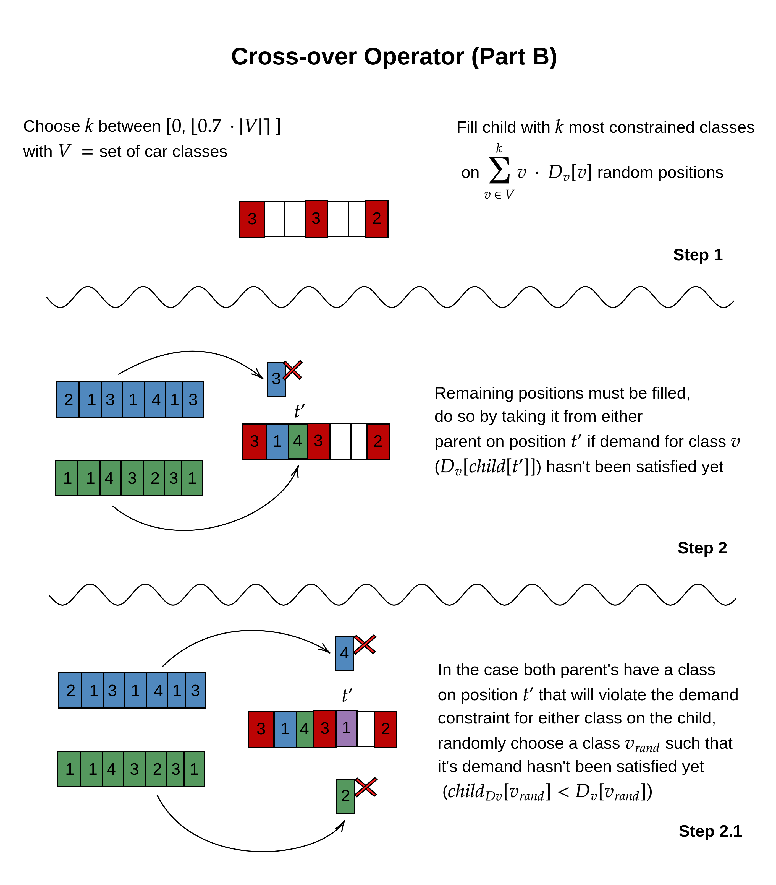

# Simple Evolutive Algorithm for the CSP
Solver for the Car Sequencing Problem on C++ using both Backtracking and an Evolutive Algorithm. Made for the Artificial Intelligence course (INF-295) at UTFSM.

Features a cross-over operator using Large Neighborhood Search (LNS) and a hybrid mutation operator.

## Usage

To compile just run on your shell where the `Makefile` is:

```bash
$ make install
```

Then, to use the solver:

```bash
$ ./bin/solver <path to instance file> <algorithm to use [evol/bt]> <n gens>
```

For cleaning objects and binary:

```bash
$ make clean
```


## Explanation
### Heuristics
Based on [Siala et al. (2015)](https://doi.org/10.1016/j.engappai.2014.10.009), in order to reliably/fastly get to a result for both the Evolutive Alg and the Backtracking Alg, variable instantiation was made following the most constrained vehicle class using the difficulty and utilities found on [Gottlieb et al. (2003)](https://doi.org/10.1007/3-540-36605-9_23) on a "left-to-right" order.

### Initial Solutions
Created randomly such that they already satisfy the demand constraints.

### Evaluation Function
Uses the improved _"sliding windows"_ function from [Zhang et al.(2017)](https://doi.org/10.1007/S10033-017-0083-7), that can be expressed as _"the number of required extra workers for an overloaded station"_. If this yields 0 then it means no (ratio) constraint was violated.

### Crossover Operator






### Mutation Operator


